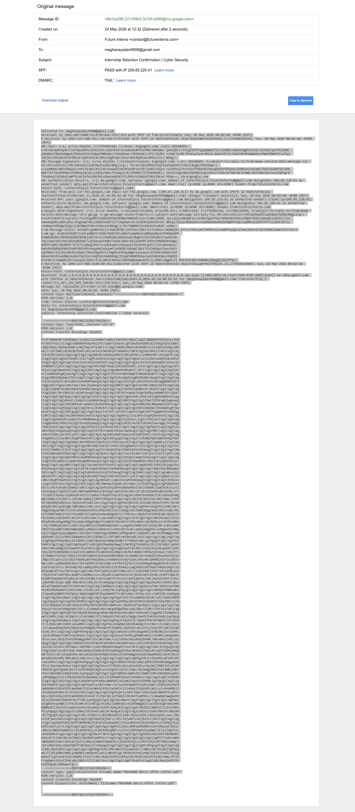
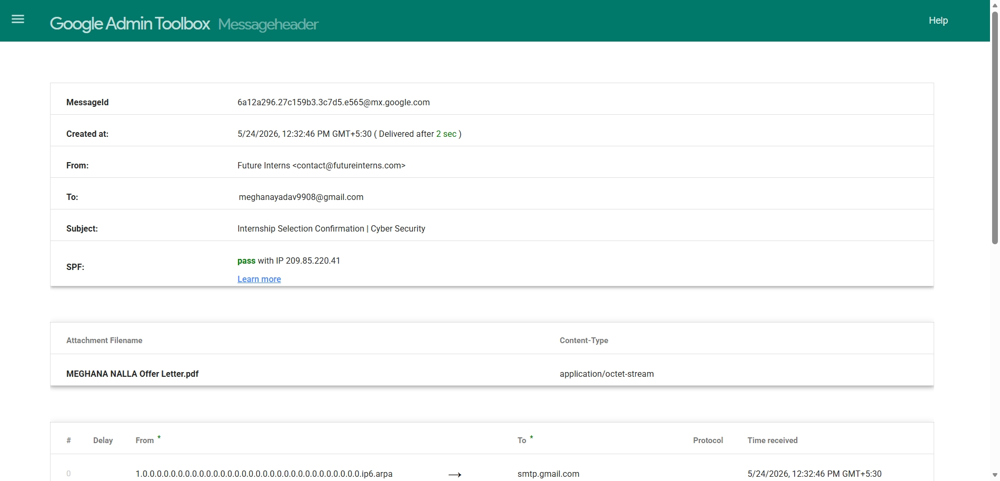

## 📸 Project Evidence Matrix

### Evidence 1: Raw Email Header Extraction
Extracted the complete internet passport routing headers directly from the message source view in the email client to inspect background transit metadata.

### Evidence 2: Security Authentication & Hop Audit
Processed the extracted raw code block through the Google Admin Toolbox. The audit logs reveal an authenticated domain validation status checking out with a green `PASS` for SPF records.

